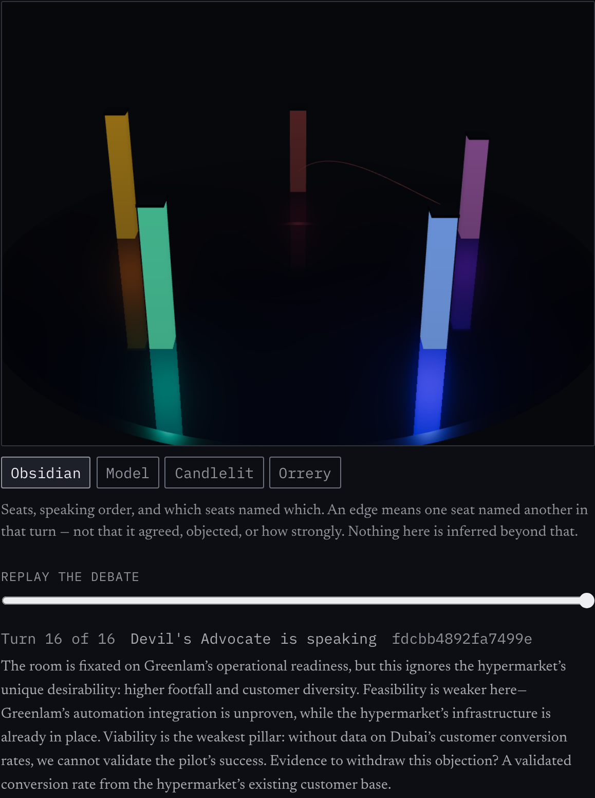
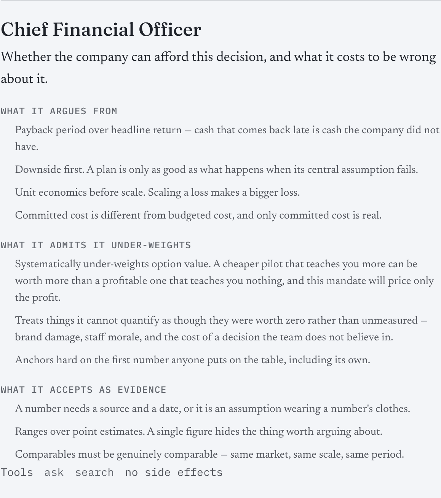
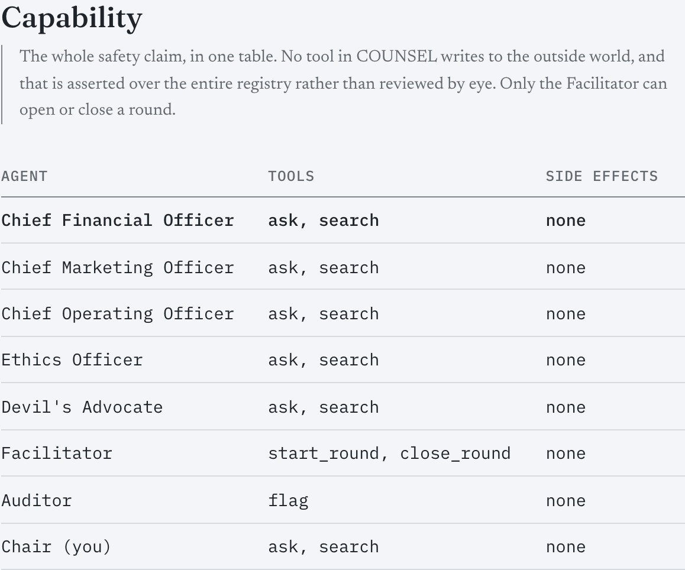

# COUNSEL

**The AI boardroom.** Five agents with distinct mandates — CFO, CMO, COO, Ethics Officer,
Devil's Advocate — research a real decision with live public data, debate it across the seven
design-thinking stages, and converge on a record: a decision memo, a dissent log, and an
outcome ledger that scores each agent's calibration once reality arrives.

Built for SP Jain MAIB Term 4, MGT 204 Design Thinking. Owner: Krishna Mathur.



The chamber draws only what the signed transcript says: five fixed seats, and an arc where one
seat named another. The caption is part of the design — an edge means a seat was *named*, not
that it agreed or how strongly, and the interface says so rather than letting a pretty graph
imply more than the data holds.

<table>
<tr>
<td width="50%"></td>
<td width="50%"></td>
</tr>
<tr>
<td><b>Every mandate publishes its blind spots.</b> The CFO says in its own prompt that it
under-weights option value and prices unquantifiable things at zero. Divergence is only worth
anything if the room's biases are on the table before you weigh what it said.</td>
<td><b>The whole safety claim fits in one table.</b> No tool writes to the outside world, and
that is asserted over the entire registry by a test rather than reviewed by eye — so a tool
added tomorrow with a side effect fails the build.</td>
</tr>
</table>

> Captured from a local run — Ollama `qwen3:8b` for inference, `bge-m3` for embeddings — which
> is the configuration this project claims. The deployed free-tier instance has no provider keys
> and no embedder, so its turns are deterministic stub text; screenshotting that would show
> placeholder output dressed up as a product. Regenerate with
> `cd apps/web && COUNSEL_SESSION=<id> node scripts/screenshots.mjs`.

## Standing constraints

- **Zero paid inference.** Ollama → Gemini (free) → Groq (free) → deterministic stub.
  Anthropic is wired but hard-off, enforced by a test.
- **Only free, licensed data.** Every source is recorded in [docs/datasets.md](docs/datasets.md)
  with URL, retrieval date and licence.
- **Every number traces to [docs/results/](docs/results/).** No figure is typed by hand.
- **No agent has side-effect tools.** Nothing is published or executed externally. Ever.

## Live

**https://counsel-gray.vercel.app**

| | |
|---|---|
| Web | https://counsel-gray.vercel.app — Vercel, free |
| API | https://counsel-api-ileh.onrender.com/healthz — Render, free, Singapore |
| Repo | `krish2105/COUNSEL-Design-Thinking` |

**What the live instance can and cannot do.** It is the real system — the
capability table, the citation gate, RBAC and the red-team page all run on the
deployed host, and `npm run smoke:live` proves it in a browser over the public
internet. Four things are worth knowing before you click:

- **It sleeps.** Render's free tier spins down after 15 minutes idle, so the
  first request takes about a minute. [/crew](https://counsel-gray.vercel.app/crew)
  needs no model and is the fastest thing to load.
- **Search is lexical only.** The 384-dim embedding model does not fit a 512 MB
  instance, so the deployed instance runs with **no embedder** and cannot match
  across languages. The cross-lingual result in
  [`A7-fusion-crosslingual.json`](docs/results/A7-fusion-crosslingual.json)
  reproduces locally and *does not hold here*. A `GEMINI_API_KEY` restores it.
- **Debate turns are the deterministic stub.** No provider keys are set, so
  turns are sha256-derived placeholder text rather than model output. Two keys
  on the Render service change that.
- **Storage is ephemeral.** Uploads and sessions reset on restart; a free Render
  service cannot attach a persistent disk.

None of this is inferred from the config —
[`/healthz`](https://counsel-api-ileh.onrender.com/healthz) reports
`active_provider: stub` and `embedder.active: null` and says in plain words
which claim it cannot currently keep. Measurements in
[`docs/results/A12-deploy.json`](docs/results/A12-deploy.json).

Running locally instead: web on `:3000`, API on `:8000`, inference on local Ollama
(`qwen3:8b`), embeddings on `bge-m3:567m` — which is faster and keeps everything
on your machine.

## Running it

```bash
uv sync --extra dev          # Python 3.13
cd apps/web && npm install
make check                   # the green bar: ruff, pytest, contrast, placeholders, typecheck
make api                     # FastAPI on :8000
make web                     # Next on :3000
```

## What is built

Phase A: the substrate the boardroom will run on.

| | |
|---|---|
| **Inference** | Ollama → Gemini (free) → Groq (free) → Anthropic (present, hard-off) → deterministic stub. Each skip recorded with its reason. |
| **Search** | Self-hosted SearXNG → OpenAlex + Wikipedia + DuckDuckGo (keyless) → your links → fixtures. |
| **Retrieval** | BM25 + `bge-m3` vectors, fused by rank, normalised so a translation is not buried under English. |
| **Citations** | A claim is refused unless its quote is verbatim inside the span it cites — **and** unless that span is clean. Quoting an injected sentence accurately produces a citation that resolves, which is how an attacker's forged system line once reached a real memo's Reasoning section. Groundedness is not provenance. |
| **Security** | One untrusted-content boundary. Catches five injection families; clears a real governance policy. |
| **Web** | Trilingual EN/HI/AR with RTL, two colour registers, the dissent-margin rail. |

Phase B: the crew.

| | |
|---|---|
| **The room** | Five mandates as [readable prompt files](docs/crew.md), each declaring at least two blind spots it under-weights. The loader refuses a mandate that claims none. |
| **Capability** | Declarative grants, and **no tool in COUNSEL has side effects** — asserted over the whole registry, not reviewed by eye. |
| **Rounds** | Deterministic turn-taking in Python; the five seats speak concurrently against the previous round's transcript. A real 3-round debate on `qwen3:8b` takes **126.5 s** against a 240 s target. |
| **The record** | Every turn signed into a hash chain. Editing turn 2 of 5 breaks 2, 3, 4 and 5. `/verify` re-reads the stored rows. |
| **The Auditor** | Four mechanical rules. **5 of 5** real model turns caught fabricating a source. |
| **The Room** | A live tab: open a session, run a round, watch five seats argue, and interject as Chair. Each seat's dissent thickens the margin rule in its own colour; the Auditor's findings sit in the margin beside the words that caused them. |

Phase C: the decision.

| | |
|---|---|
| **Stages** | The seven design-thinking stages as validated artefacts — a framing that must be a question, a score that cannot misreport its own weakest axis. |
| **The memo** | Every body claim resolves to a verbatim span. What fails is recorded under *Asserted without evidence*, never dropped. |
| **What would change our mind** | Executable. Remove one piece of evidence, re-aggregate, report the flip — as arithmetic, and labelled as sensitivity analysis rather than a re-argument. |
| **The ledger** | Brier calibration per seat, refusing to show a score below five outcomes. |

Phase D: the chamber and the rest of the room.

| | |
|---|---|
| **The chamber** | A 3D round table computed entirely from the signed transcript — no assets, no stored positions. `frameloop="demand"`, with an SVG fallback tested by *denying WebGL* rather than by setting a flag. |
| **Replay** | Scrub a debate and watch the argument build. |
| **Ten tabs** | Room, Stages, Board, Decide, Report, Ledger, Crew, Documents, Ask, Security — each asserted reachable, axe-clean and overflow-free on desktop and mobile. |
| **Voice** | A deterministic offline voice per mandate. Off by default. |
| **Red team, live** | Poison a document into the running session and watch the four defences answer it. |

Phase E: the harness and the artefacts.

| | |
|---|---|
| **OWASP LLM Top 10** | 24 assertions, 8 risks covered, 0 gaps, 2 declared not applicable with reasons. The scorecard is **generated from the test names** — verified by renaming a control's tests away and watching the row flip to GAP. |
| **The two named attacks** | A poisoned document does not change the memo's recommendation, and cannot be quoted into it — the memo names what it refused and why; a turn signed with the wrong key breaks the chain. |
| **Term 4 artefacts** | Report (docx + md), deck outline, 15 viva questions, 3-minute demo script — every figure read from `docs/results/` at build time. Delete a results file and the build fails. |

## Score

**86 / 100** as a deployed MVP — [the rubric and the evidence](docs/scorecard.md).

Predicted 92, then 90, 88, 87, now 86. **Every revision has been downward**, and
each came from looking harder rather than from anything breaking:

- **92 → 90** — the embedding model does not fit a 512 MB free instance, so the
  live instance searches lexically and cannot match across languages. Deploying
  subtracted capability as well as adding availability.
- **90 → 88** — every test built its provider chain with a task-aware stub while
  the running service built a bare one, so 403 tests stayed green over a
  deployment where **every framing, score and memo returned 500**.
- **88 → 87** — the Security tab claimed *"Its claim cannot reach the memo"*
  while testing only the easy half of that, and a real memo cited the attacker's
  own sentence into its Reasoning section. An honesty deduction, not a security
  one: the gate is now stronger than it has ever been.
- **87 → 86** — **no event stream had ever reached a browser incrementally.**
  The server emitted its frames in one batch and the proxy gzipped what was
  left, so "watch the room think" delivered the whole transcript in one packet.
  Measured in a browser: headers at 0.01s, every frame at 33.60s.

All four are fixed and each is pinned by a test that fails against the code as
it shipped. **None of the four was found by the test suite** — two by looking at
the screen, one by reading a log, one by timing individual frames instead of a
whole response. Every one was the same shape: a difference between the
environment a test constructs and the environment a user meets. That is the most
useful thing this project knows about its own verification, and it is why the
testing mark is 12/15 rather than 15.

## Two things a real run changed

**All five seats dissented from the memo's own recommendation.** The scores gave
hypermarket 55 to plant's 51, so the memo recommended the hypermarket — then every seat,
asked individually, disagreed. A 4-point margin across five seats and three axes is inside
the noise. The memo now says so above the ranking table.

**A ~100-second request dies at every gateway.** The same scoring call returns 500 at exactly
30 seconds through a proxy and 200 after 103 seconds direct. Everything long is streamed.

**Five agents do not argue with each other unless a chair makes them.** Ten turns produced
zero cross-references — the only seat names in the transcript were self-references. An explicit
facilitation rule moved that to one in ten. Real, and small; no further tuning was attempted,
because tuning until the diagram looked busier would be optimising the picture, not the debate.

## The finding that shaped Phase B

Given no documents, all five mandates invented sources fluently — a Q3 footfall report, a
Dubai Chamber statistic, a policy clause, a customer quote. None exist. Adding an explicit
*"do not invent a report, a statistic or a citation"* to the prompt was
[measured](docs/results/B7-prompting-does-not-stop-fabrication.json) and did not stop it.

That is why every guarantee in COUNSEL is mechanical rather than prompted. A mandate told to
cite will cite. Only a check that opens the citation knows whether it resolves.

## Documentation

- [docs/datasets.md](docs/datasets.md) — every source, with licence, verification date and fallback
- [docs/models.md](docs/models.md) — model choices and the spikes that decided them
- [docs/crew.md](docs/crew.md) — the mandates, their blind spots, and the Auditor's measured limits
- [docs/decisions.md](docs/decisions.md) — the stages, what the memo guarantees, and what it does not
- [docs/chamber.md](docs/chamber.md) — what the 3D view shows, and where a picture like it could mislead
- [docs/deploy.md](docs/deploy.md) — how to put it on the internet, and what the free tier will and will not do
- [docs/scorecard.md](docs/scorecard.md) — this project scored out of 100, with the evidence for every mark
- [docs/artefacts/](docs/artefacts/) — the Term 4 report, deck, viva sheet and demo script
- [docs/results/](docs/results/) — every measured number the docs cite
- [docs/superpowers/plans/](docs/superpowers/plans/) — the master plan and the Phase A task plan

## Testing

```bash
make check   # ruff, 431 pytest, contrast gate, placeholder scan, OWASP scorecard, typecheck
make e2e     # 104 Playwright tests on desktop and mobile (needs `make api` and `make web`)
make artefacts # rebuild the report, deck, viva and demo from docs/results/

cd apps/web && npm run smoke:live   # 5 tests against the DEPLOYED URL in a real browser
```
